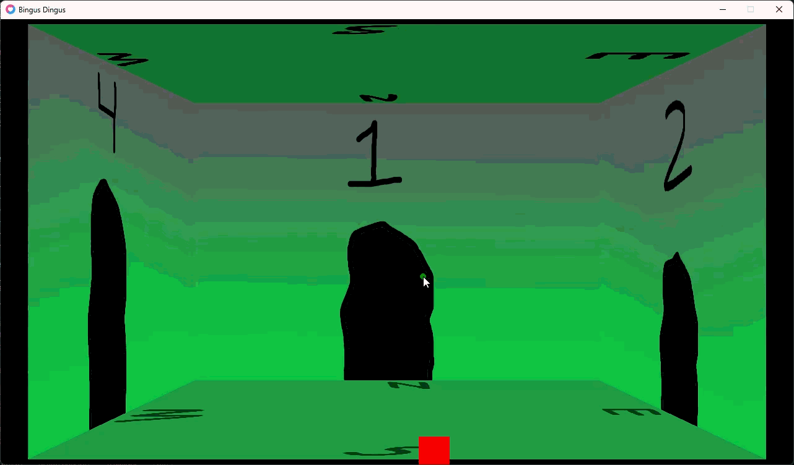
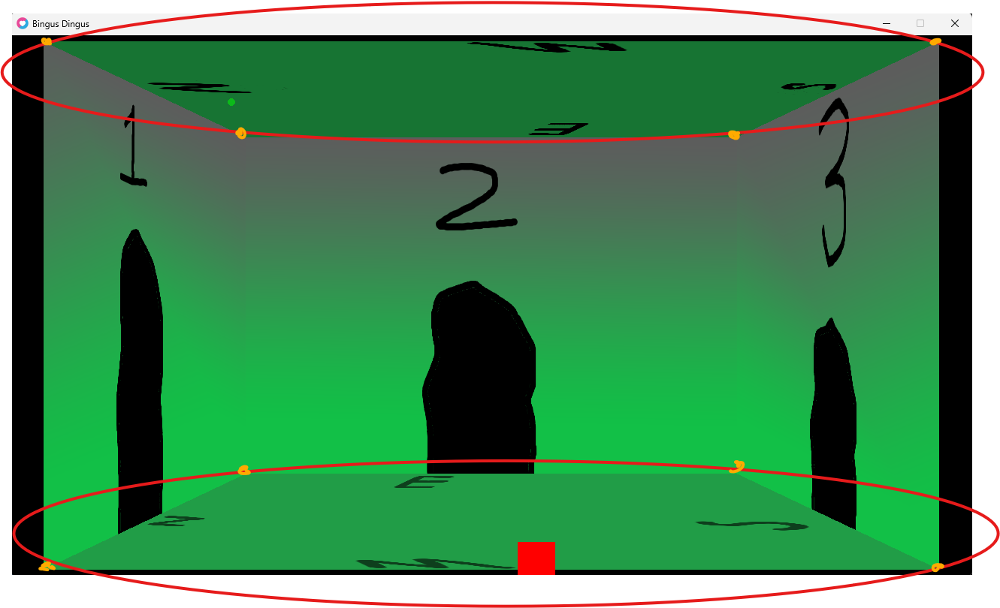

# Project EXPANSE
Project intended to expand my personal technical knowledge and pursue my hobby in software development

## WHY LUA?
-Lua is almost as fast as C but without the complex memory management
-Lua better than python for lightweight straightforward development
-I like lua games so I like lua

## What does it do?
Proof of concept for a game about going through door to door
You can turn right and left and move forward and backward (WIP)

Additionally I did proof of concept collision and text boxes because you cant have a game without collision and textboxes

## What is actually happenning?

To best explain my implementation, imagine a square rotating about an axis. The shape it creates from corner to corner is a circle. Now in order to best simulate a room rotating (with as much fluididty as possible) I calculated the position of two squares (eight verticies) across two 'imaginary' elipses. 

tweaking a simple sin cos angle calculation was enough to get what I wanted, however texture mapping was more painful than I expected. Having a 3 dimensional object means I needed to hide the face of the cube of the backwall somehow during rotation. additionally, the images I made looked strange when being stretched or flipped in certain cases. The solution I came up with involved resetting the rotation after it had been completed but changing the mesh textures in the same loop. Additionally I gradually reduced the opacity of of the wall opposite the direction you would be turning and inversely increased the opacity of the back wall. (The gifs I provided should be self explanatory)
